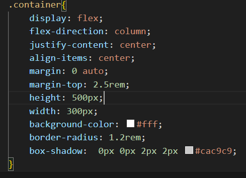

# QR-Code-Component_Frontend_Mentor

Hi Everyone!, This repo is dedicated for building QR code component which is a project from Frontend_Mentor repo. This is a part of GSS0C'24 Extd Edition.

Git Hub repo link: https://github.com/ApoorvaSunkad/QR-Code-Component_Frontend_Mentor.git

Live solution link: https://incredible-semifreddo-283c99.netlify.app/

My Process:

Built with:

Semantic HTML5 markup
CSS properties
Flexbox
Media queries

What I learned?

I learnt how do we center div. How we can resize images according to the containers. Also how flex box helps to arrange the HTML elements in perfect manner.

Code snippet:

Continued development:

This component is designed only using HTML and CSS but in future I'm planning to build it using React.js library as I'm in learning phase of React.js. So stay tuned for further updates.

Helpful Resources:

Helped me with my flexbox concepts:
https://www.w3schools.com/css/css3_flexbox.asp